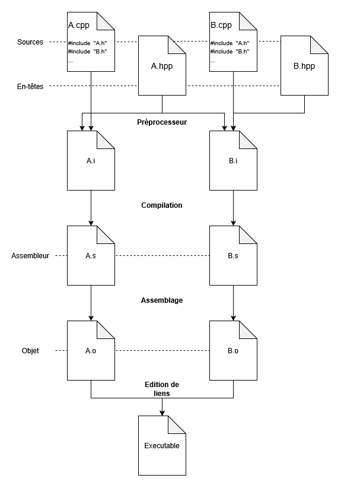

Notes de cours complémentaires
==============================

Comment me contacter ?
----------------------

Valentin Perrelle <<valentin.perrelle@cea.fr>>


Où trouver le cours ?
---------------------

|  | 
|:---|:---|
| https://perso.ensta.fr/~bmonsuez/Cours/doku.php?id=in204 | https://github.com/perrelle/in204 |


Qu'est-ce que la programmation orientée objet ?
-----------------------------------------------

1. La programmation orientée objet est un paradigme de programmation.

    [Wikipedia](https://fr.wikipedia.org/wiki/Paradigme_(programmation)) :

    > Le paradigme de programmation est la façon (parmi d'autres) d'approcher la
    > programmation informatique et de formuler les solutions aux problèmes et leur
    > formalisation dans un langage de programmation approprié.

2. La programmation orienté objet repose sur l'idée que la description des
   données et les fonctions qui les manipulent doivent être liés.


Exemple pratique
----------------

On cherche à manipuler des matrices. En C, le type d'une matrice peut être
décrit de la manière suivante.

```c
struct matrix {
  int width;
  int height;
  int *cells;
};
````

On pourra définir une série de fonctions pour construire une matrice et
la manipuler (voir [matrix-c.c](exemples/matrix-c.c)).

```c
struct matrix matrix_create(int width, int height, int value);
void matrix_destroy(struct matrix *m);
int matrix_get(struct matrix *m, int row, int col);
void matrix_set(struct matrix *m, int row, int col, int value);
void matrix_init(struct matrix *m, int value);
void matrix_print(struct matrix *m);
```

En C++, on regroupe la définition du type et les fonctions qui le manipulent
dans une seule déclaration. (voir [matrix-cpp.cpp](exemples/matrix-cpp.cpp)).

```c
struct matrix {
  int width;
  int height;
  int *cells;

  matrix(int width, int height, int value);
  ~matrix();
  int get(int row, int col);
  void set(int row, int col, int value);
  void init(int value);
  void print();
};
```

- Ceci définit une *classe* d'*objets*.
- Les objets sont des *instances* de la classe.
- Les champs de la classe sont appelées *propriétés*.
- Les fonctions de la classe sont appelées *méthodes*.

Les méthodes peuvent être définies directement dans la déclaration de la classe,
ou - ce qui est souvent préférable pour la lisibilité - après la déclaration
de la classe. Dans ce cas, on utilisera l'opérateur de résolution de portée,
noté `::` pour définir les différentes méthodes.


### La construction et destruction

- En C.

  ```c
  struct matrix matrix_create(int width, int height, int value) {
    int *cells = malloc(width * height * sizeof(int));
    struct matrix m = { width, height, cells };
    matrix_init(&m, value);
    return m;
  }

  void matrix_destroy(struct matrix *m) {
    free(m->cells);
    m->cells = NULL;
  }
  ```

- En C++, pas de type de retour pour ces fonctions, et un nom identique à
  la classe avec un `~` préfix pour le destructeur.

  ```c++
  matrix::matrix(int width, int height, int value) :
      cells(new int[width * height * sizeof(int)]),
      width(width),
      height(height)
  {
    init(value);
  }

  matrix::~matrix() {
    delete [] cells;
  }
  ```

### Les méthodes d'accès

- En C.

  ```c
  int matrix_get(struct matrix *m, int row, int col) {
    assert(0 <= row && row < m->height);
    assert(0 <= col && col < m->width);
    assert(m->cells != NULL);
    return m->cells[row * m->width + col];
  }

  void matrix_set(struct matrix *m, int row, int col, int value) {
    assert(0 <= row && row < m->height);
    assert(0 <= col && col < m->width);
    assert(m->cells != NULL);
    m->cells[row * m->width + col] = value;
  }
  ```

- En C++.

  ```c++
  int matrix::get(int row, int col) {
    assert(0 <= row && row < height);
    assert(0 <= col && col < width);
    return cells[row * width + col];
  }

  void matrix::set(int row, int col, int value) {
    assert(0 <= row && row < height);
    assert(0 <= col && col < width);
    cells[row * width + col] = value;
  }
  ```

### Les deux autres méthodes

- En C.

  ```c
  void matrix_init(struct matrix *m, int value) {
    for (int i = 0; i < m->height; i++) {
      for (int j = 0; j < m->width; j++) {
        matrix_set(m, i, j, value);
      }
    }
  }

  void matrix_print(struct matrix *m) {
    for (int i = 0; i < m->height; i++) {
      for (int j = 0; j < m->width; j++) {
        printf("%3d ", matrix_get(m, i, j));
      }
      printf("\n");
    }
  }
  ```

- En C++.
  
  ```c++
  void matrix::init(int value) {
    for (int i = 0; i < height; i++) {
      for (int j = 0; j < width; j++) {
        set(i, j, value);
      }
    }
  }

  void matrix::print() {
    for (int i = 0; i < height; i++) {
      for (int j = 0; j < width; j++) {
        std::cout.width(3);
        std::cout << get(i, j) << " ";
      }
      std::cout << std::endl;
    }
  }
  ```

### Utilisation de la classe

- En C.

  ```c
  int main(void) {
    struct matrix m = matrix_create(4, 4, 1);
    matrix_set(&m, 1, 1, 0);
    matrix_print(&m);
    matrix_destroy(&m);
    return 0;
  }
  ```

- En C++.

  ```c++
  int main(void) {
    matrix m(4, 4, 1); // Appelle le constructeur, garantie l'initialisation
    m.set(1, 1, 0);
    m.print();
    return 0; // Au retour, appel automatique du destructeur
  }
  ```

### Avantages syntaxiques

- Le paramètre `struct matrix m` de chaque fonction devient *implicite*.
- On peut accéder aux propriétés directement sans faire `m->`. Si toutefois
  on veut rendre explicite l'accès à l'instance manipulée, on peut utiliser
  le mot clé `this` et écrire `this->` pour accéder aux propriétés ou méthodes
  de l'instance.
- Le constructeur a le même nom que la classe et n'a pas besoin de type de
  retour.
- La construction d'un objet est plus concise.

### Avantages de robustesse

- **Garantie de construction**. Dès qu'un constructeur est défini, il n'est plus
  possible de construire une instance sans utiliser l'un des constructeurs.
  Ainsi, si on veut éviter des erreurs de non-initialisation, il suffit de
  fournir des constructeurs qui initialisent l'objet, et on est certain que
  tous les objets seront toujours initialisés de la construction jusqu'à la
  destruction.
- **Destruction automatique**. Dès qu'une instance déclarée localement sort
  de sa portée, le destructeur de l'objet est appelé. Ceci permet, par exemple,
  de garantir que les ressources allouées pendant la vie de l'objet seront
  toujours désallouées.

### Surcharge de constructeur

On peut définir plusieurs constructeurs, qui ne diffèrent que par le nombre ou
le type de leurs arguments. Par exemple, pour définir un constructeur de
matrices carrées :

```c++
matrix::matrix(int size) :
    cells(new int[size * size * sizeof(int)]),
    width(size),
    height(size)
{
  init(0);
}
```

### Empêcher l'appel implicite du constructeur

Avec le constructeur précédent On pourrait écrire

```c++
matrix x = 1;
```

C'est certainement une erreur de la part du programmeur, mais c'est accepté par
le compilateur, qui le comprend comme l'appel à un *constructeur de conversion*
de l'entier 1 vers la classe `matrix`, c'est à dire, comme si on avait écrit.

```c++
matrix x(1);
```

Pour repérer l'erreur au moment de la compilation, il est de bon usage
d'interdire la conversion implicite, en ajoutant le mot clé `explicit` dans
la déclaration du constructeur.

```c++
  explicit matrix(int size);
```

Étapes de compilation
---------------------

Comprendre les étapes de compilation est nécessaire pour comprendre les erreurs
émises par le compilateur. Savoir quelle étape pose problème permet de savoir
quel genre de solution il faut chercher.

Historiquement, le processus de construction d'un exécutable à partir d'une code
source écrit en C ou C ++ est divisé en quatre étapes :

- le préprocesseur,
- la compilation,
- l'assemblage et
- l'édition de lien.



Dans les compilateurs récents, les deux premières étapes ne sont pas
nécessairement séparées et plusieurs passent de transformation peuvent avoir
lieu sur une ou plusieurs représentations intermédiaire.

### Exemple avec GCC

- **Préprocesseur**

  ```
  gcc -E a.c -o a.i
  ```

- **Compilation**

  ```
  gcc -S a.i -o a.s
  ```

- **Assemblage**

  ```
  gcc -c a.s -o a.o
  ```

- **Édition de liens**

  ```
  gcc a.o -o a.exe
  ```

Contrôle d'accès
----------------

- Par défaut, les propriétés et les méthodes d'une classe déclarée avec `struct`
  sont *publics*.
- On peut interdire l'accès aux propriétés et l'appel des méthodes en ajoutant
  le mot clé private.

  ```c++
  struct matrix {
  private:
    int width;
    int height;
    int *cells;

  public:
    matrix(int width, int height, int value = 0);
    explicit matrix(int size);
    ~matrix();
    int get(int row, int col);
    void set(int row, int col, int value);
    void init(int value);
    void print();
  };
  ```

- A l'inverse, si on déclare la classe avec le mot clé `class`, les champs
  sont par défaut `private`.

  ```c++
  class matrix {
    int width;
    int height;
    int *cells;

  public:
    matrix(int width, int height, int value = 0);
    explicit matrix(int size);
    ~matrix();
    int get(int row, int col);
    void set(int row, int col, int value);
    void init(int value);
    void print();
  };
  ```

- Dans cet exemple, cela permet de garantir qu'aucun code extérieur à la
  classe ne peut modifier les proprétés `width`, `height` ou `cells`. Non
  seulement, cela permet de s'assurer que `cells` pointe toujours sur
  un tableau bien initialisé mais aussi que sa taille reste `width * height`.

- En d'autres termes, la restriction d'accès permet de réduire la quantité 
  de code source sur lequel il est nécessaire d'être vigilants. A l'inverse,
  si un bug se produit à l'usage de cette classe, il ne sera nécessaire de
  lire que les méthodes de cette classe.
