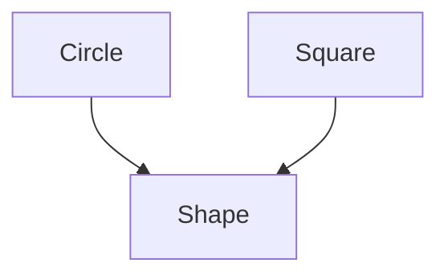
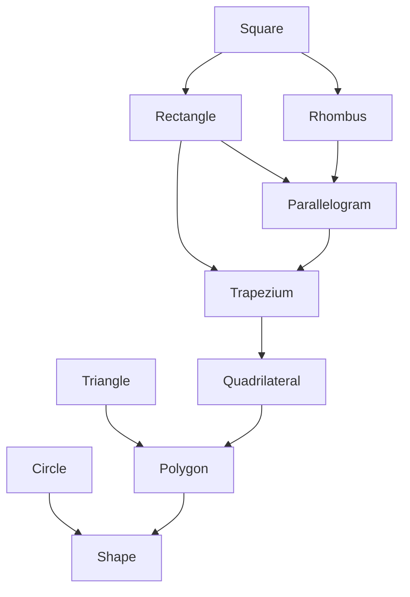

Notes de cours complémentaires
==============================

Le principe de réutilisation
----------------------------

La réutilisation de code est une problématique qui revient régulièrement dans
le développement de logiciel. Si on a besoin de deux version quasiment
similaires du même code, il est judicieux de construire une fonction
dont le comportement sera soit celui du premier code, soit celui du second,
en fonction de ces paramètres.

Prenons l'exemple [bases.cpp](exemples/bases.cpp). Il contient fonction de
conversion de nombre en chaîne en base 10.

```c++
std::string int_to_string10(unsigned int n) {
  char buffer[10];
  int i = 10;
  buffer[--i] = '\0';
  do {
    buffer[--i] = n % 10 + '0';
    n = n / 10;
  }
  while (n > 0);
  return std::string(buffer + i);
}
```

On peut la copier et remplacer les 10 par ds 2 pour avoir une conversion en
base 2.

```c++
std::string int_to_string2(unsigned int n) {
  char buffer[33];
  int i = 33;
  buffer[--i] = '\0';
  do {
    buffer[--i] = n % 2 + '0';
    n = n / 2;
  }
  while (n > 0);
  return std::string(buffer + i);
}
```

On préférera plutôt en écrire une version plus générale prenant la base
en paramètre, quitte à ce que ce paramètre ait une valeur par défaut.

```c++
std::string int_to_string(unsigned int n, int base = 10) {
  char buffer[33];
  int i = 33;
  buffer[--i] = '\0';
  do {
    buffer[--i] = n % base + '0';
    n = n / base;
  }
  while (n > 0);
  return std::string(buffer + i);
}
```

Le fait de n'avoir qu'une seule fonction au lieu de plusieurs versions
distinctes d'un code a plusieurs avantages.

1. **Lisibilité**. Souvent, le code ainsi écrit est plus concis et il est donc
   plus rapide ou plus facile pour le lecteur de s'y retrouver que s'il devait
   naviguer parmi plusieurs versions similaires. En outre il peut être difficile
   de voir ce qui est commun et ce qui est différent entre des versions, tandis
   que lorsqu'on a écrit une fonction, on voit comment les paramètres de la
   fonction influence ses différents appels.
2. **Robustesse**. Si on a un bug dans une des versions, ce bug va être
   plus difficile à débusquer que s'il est dans une fonction où il peut
   se manifester à chaque appel. A l'inverse, quand on veut corriger le code,
   il n'est nécessaire de le corriger qu'à un seul endroit, tandis qu'une
   correction pourrait facilement être oubliée dans l'une des versions.
3. **Généricité**. Le code source évoluant, il est possible que de nouvelles
   versions soient nécessaires alors que si on a une fonction, il suffit
   souvent d'appeler la fonction avec les bons paramètres.

Le même principe de réutilisation de code existe dans la programmation orientée
objet. Prenons l'exemple [shapes.cpp](exemples/shapes.cpp). Imaginons que nous
ayons besoin de manipuler des formes géométriques, connaître leurs propriétés et
pouvoir les transformer, pourquoi pas pour générer des images au format SVG. Le
fichier commence par définir une classe `Point` qui permet de manipuler des
coordonnées dans un espace en deux dimensions.

```c++
struct Point {
  float x;
  float y;

  Point() : x(0), y(0) {};
  Point(float x, float y) : x(x), y(y) {}

  void translate(Point vector) {
    x += vector.x;
    y += vector.y;
  }
};
```

Puis on définit une classe `Circle`, caractérisant des cercles par leur centre
et leur rayon et muni d'une méthode pour appliquer une translation au cercle et
d'une méthode pour calculer son aire.

```c++
class Circle {
private:
  Point center;
  float radius;

public:
  Circle(Point center, float radius) :
    center(center),
    radius(radius)
  {}

  void translate(Point vector) {
    center.translate(vector);
  }

  float area() const {
    const float pi = 3.14159265f;
    return pi * radius * radius;
  }
};
```

De la même manière, une classe `Square` caractérisant des carrés par leur
centre et la mesure de leur côtés.

```c++
class Square {
private:
  Point center;
  float side;

public:
  Square(Point center, float side) :
    center(center),
    side(side)
  {}

  void translate(Point vector) {
    center.translate(vector);
  }

  float area() const {
    return side * side;
  }
};
```

On remarque qu'on a dû écrire deux fois la méthode `translate(Point)`,
strictement identique. Si les classes avaient des méthodes `horizontal_flip` ou
`vertical_flip` pour appliquer des symétrie selon un axe $x = c$ ou $y = c$
respectivement, on aurait également exactement les mêmes fonctions dans chaque
classe. Pour éviter cette duplication du code, on peut définir une troisième
classe, la classe `Shape` qui contiendra les propriétés et les méthodes communes
et qui servira de *classe de base* pour les deux classes. 

```c++
class Shape {
private:
  Point center;

public:
  Shape(Point center) : center(center) {}

  void translate(Point vector) {
    center.translate(vector);
  }
};
```

Ensuite, on redéfinit `Circle` et `Square` comme des *extensions* de cette
classe de base. Elles héritent des propriétés et méthodes déclarées dans `Shape`
et ajoutent leurs propres propriétés et méthodes.

```c++
class Circle : public Shape {
private:
  float radius;

public:
  Circle(Point center, float radius) : Shape(center), radius(radius) {}

  float area() const {
    const float pi = 3.14159265f;
    return pi * radius * radius;
  }
};

class Square : public Shape {
private:
  float side;

public:
  Square(Point center, float side) : Shape(center), side(side) {}

  float area() const {
    return side * side;
  }
};
```

### Terminologie

- `Shape` est la *classe de base* ou *classe mère*
- `Circle` et `Square` sont des *classes dérivées* ou *classe enfant*.
- `Circle` et `Square` *dérivent* de `Shape` et *héritent* de leur propriétés
  et de leurs méthodes.

### Hiérarchie de classe

L'héritage permet de construire une hiérarchie de classe.



On peut enrichir autant que nécessaire cette hiérarchie. Pour rester dans la
définition des formes, on peut introduire les classes `Polygon`,
`Quadrilateral`, `Rectangle`, etc.



Pointeurs vs References
-----------------------

Les deux exemples [pointers.cpp](exemples/pointers.cpp) et
[references.cpp](exemples/references.cpp) montrent ce qui est autorisé et
interdit avec les pointeurs et les références. Les deux sont
représentés de la même manière, mais diffèrent dans l'usage.

Les pointeurs peuvent être nuls, ils peuvent modifiés et manipulés grâce
à de l'arithmétique de pointeurs.

```c++
void f() {
    int x;
    int *p = &x; // Basic pointer initialization
    int *q;      // Uninitialized pointers are valid
    int y = *p;  // Read the pointed memory
    *p = y + 1;  // Write to the pointed memory
    p = &y;      // Pointers can be updated
}

void g() {
    int t[10];
    int *p;
    // Two distinct syntaxes, same result
    p = &t[0];
    p = t;
    // Pointer arithmetic, again two distinct syntaxes
    int y;
    y = t[3];
    y = *(t + 3);
}

struct s {
    int field;
};

void h() {
    s x;
    s *p = &x;
    int y;
    // Two distinct syntaxes, same result
    y = (*p).field;
    y = p->field;
}
```

Les références n'ont pas ces possibilités, mais sont plus simples d'usage, grâce
à une syntaxe simplifiée. 

```c++
void f() {
    int x;
    int &r = x;  // Basic pointer initialization
    // int &r2;  // Uninitialized references are forbidden
    int y = r;   // Read the referenced memory
    r = y + 1;   // Write to the referenced memory
    // r = &y;   // References cannot be updated
}

struct s {
    int field;
};

void g() {
    s x;
    s &p = x;
    int y;
    y = p.field;
}
```

Ordre de construction
---------------------

L'ordre d'initialisation des propriétés d'un objet suit les règles suivantes.

- On appelle d'abord le constructeur de la classe de base.
- Puis, on appelle les constructeurs des propriétés dans l'ordre de leur
  déclaration dans la classe.
- Enfin, on exécute le corps du constructeur.

L'exemple [constructor-order.cpp](exemples/constructor-order.cpp) permet
d'illustrer ce comportement.


Ordre de destruction
--------------------

L'ordre de destruction est l'exact inverse de la construction.

- On exécute le corps du destructeur.
- Puis, on appelle les destructeurs des propriétés dans l'ordre inverse de leur
  déclaration dans la classe.
- Enfin, on appelle le destructeur de la classe de base.

L'exemple [destructor-order.cpp](exemples/destructor-order.cpp) permet
d'illustrer ce comportement.


Restriction d'accès
-------------------

En plus de `public` et `private`, un troisième type d'accès peut être
donné : `protected`. Il sert à dire qu'un champ ne peut pas être accédé de
l'extérieur, comme s'il était `private`, mais à l'inverse de `private`, les
classes dérivées peuvent y accéder. En résumé :

- `public` définit des champs accessibles partout,
- `private` définit des champs accessibles qu'à l'intérieur de la classe et
- `protected` définit des champs accesibles qu'à l'intérieur de la classe ou
  d'une des classes dérivées.

|                   | Dans la classe | Dans la classe dérivée | En dehors |
|:------------------|:--------------:|:----------------------:|:---------:|
| Champ `public`    |       ✅        |           ✅            |     ✅     |
| Champ `protected` |       ✅        |           ✅            |     ❌     |
| Champ `private`   |       ✅        |           ❌            |     ❌     |

Ces trois mots clés peuvent être insérés dans la déclaration d'une classe,
avant le nom de la classe de base :

```c++
class B : public A {};
```

Cela permet de dire si la relation d'héritage est

- *publique* et on peut manipuler des objets de la classe B comme s'ils étaient
  des objets de la classe A;
- *protégée* et la relation d'héritage est alors invisible en dehors des
  classes dérivées elles-même, ce qui empêche le code extérieur d'accéder aux 
  membres - mêmes publics - de la classe de base;
- *privée* et même les classes dérivées ne peuvent accéder aux champs privés
  ou protégés de la classe de base.

Le type d'héritage modifie la spécification d'accès des champs. Ainsi, un
champ `public` devient `private` quand l'héritage est lui-même `private`.
Le tableaux suivant synthétise les règles d'héritage et l'exemple
[access.cpp](exemples/access.cpp) en est une illustration.

|                   | Héritage `public` | Héritage `protected` | Héritage `private` |
|:------------------|:-----------------:|:--------------------:|:------------------:|
| Champ `public`    |     `public`      |     `protected`      |     `private`      |
| Champ `protected` |    `protected`    |     `protected`      |     `private`      |
| Champ `private`   |     `private`     |      `private`       |     `private`      |


Masquage
--------

La déclaration dans la classe dérivée d'une méthode avec le même nom qu'une
méthode de la classe de base n'est pas une *redéfinition* (un
remplacement) c'est un *masquage* : les deux méthodes coexistent mais la
première masque la seconde. On peut néanmoins toujours accéder à toutes les
méthodes grâce à l'opérateur de résolution de portée `::`, comme le
montre l'exemple [masquage.cpp](exemples/masquage.cpp) :

```c++
class A {
public:
  void f() {
    std::cout << "A::f()" << std::endl;
  }
};

class B : public A {
public:
  void f() {
    std::cout << "B::f()" << std::endl;
  }

  void f(int x) {
    std::cout << "B::f(int)" << std::endl; 
  }
};

int main() {
  A a;
  B b;
  a.f();
  b.f();
  b.A::f();
  b.f(1);
  return 0;
}
```

Transtypage
-----------

[Exemple](exemples/transtyping.cpp)
