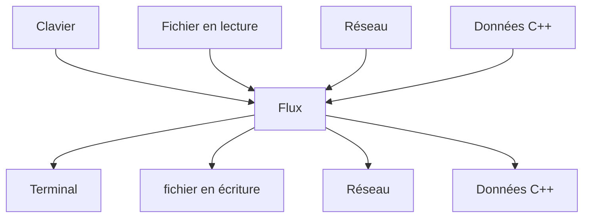
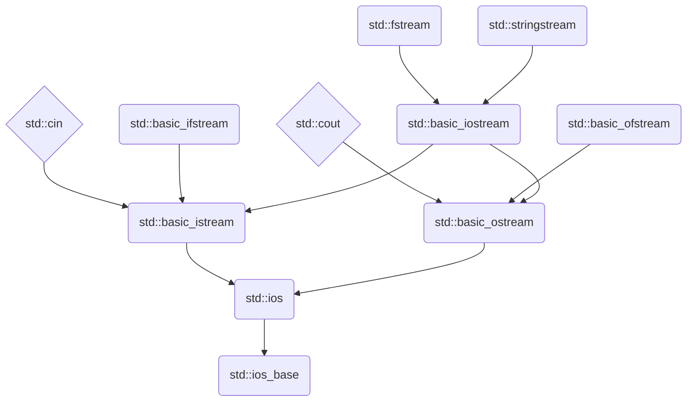

Notes de cours complémentaires
==============================

Rappels sur la notion de surcharge 
----------------------------------

La *surcharge* est la définition d'une ou plusieurs versions alternative d'une
fonction. Le compilateur choisit quelle version appeler en fonction du nombre ou
du type des paramètres. ([overloading.cpp](exemples/overloading.cpp))

```c++
#include <cmath>

// Overloading of function norm

int norm(int x) {
  return x >= 0 ? x : -x;
}

double norm(double x) {
  return x >= 0.0 ? x : -x;
}

double norm(double x, double y) {
  return sqrt(x * x + y * y);
}

int main(void) {
  norm(42); // call to norm(int)
  norm(3.14159); // call to norm(double)
  norm(42.0, 2.0); // call to norm(double, double)
}
```

On dit que la fonction `norm` est *surchargée*. C'est un moyen commode de
proposer une série de fonctions au comportement similaire, mais s'appliquant sur
des types différents. Cette solution évite de recourir à des préfixes ou des
suffixes dans le nommage d'une fonction. Pour l'exemple, les noms préfixés
seraient `norm_int`, `norm_int_int` et `norm_double`.

Elle est adaptée s'il le comportement est clair d'après le nom de la fonction -
ce qui n'est pas vraiment le cas de la version avec deux `double`, qui pourrait
cependant correspondre à la norme d'un nombre complexe.


Surcharge d'opérateur
---------------------

En C++, il est possible de surcharger la plupart des opérateurs (`+`, `-`,
etc.). Cela permet notamment d'étendre le sens des opérateurs à des types
définis par le programmeur. Nous en avons déjà vu quelques exemples. Le plus
criant sont les opérateurs `<<` et `>>` de décalage binaire à gauche et à droite
respectivement, surchargés en C++ pour les opérations de flux d'entrée / sortie.

```c++
#include <iostream>

int main() {
  // Use of overloaded operator <<
  std::cout << "Hello World" << std::endl;
}
```

Un second exemple est la surcharge de l'opérateur `[]` pour l'accès aux
vecteurs.

```c++
#include <vector>

int main() {
  std::vector<int> v { 0, 1, 42 };
  // Use of overloaded operator []
  return v[0];
}
```

La surcharge d'opérateur permet d'utiliser une syntaxe plus concise et,
idéalement, plus lisible. Le risque parfois est de rendre le code plus difficile
à comprendre : il faut savoir que l'opérateur a été surchargé et comprendre
comment il a été surchargé.

Quasiment tous les opérateurs peuvent être surchargés, y compris les opérateurs
`->` et `->*`, `&&` et `||` (mais alors ils perdent leur sémantique
*paresseuse*), et même `new` et `delete`. Il y a des exceptions : `::`, `.`,
`.*` et `:?` ne peuvent pas être surchargés.


Exemple de surcharge d'opérateur
--------------------------------

Considérons cette classe définissant des nombres complexes
([complex.cpp](exemples/complex.cpp)).

```c++
#include <iostream>

class Complex {
  double x, y;

public:
  Complex() : x(0.0), y(0.0) {} // Default constructor
  Complex(double x) : x(x), y (0.0) {} // **Implicit** conversion constructor
  Complex(Complex &c) : x(c.x), y(c.y) {} // Copy constructor
  Complex(double x, double y) : x(x), y(y) {} // Regular constructor

  void print() {
    std::cout << x << " + " << y << "i";
  }

  Complex add(Complex const &right) const {
    return Complex(x + right.x, y + right.y);
  }
};
```

Notez les deux usages de `const` qui indiquent que la fonction `add` s'applique
sur un objet constant et prend en paramètre constant : la fonction ne modifie ni
l'un ni l'autre.

Pour additionner deux nombres complexes `c1` et `c2` il faut l'écrire de la
manière suivante

```c++
c1.add(c2);
```

L'addition est définie comme une méthode de la classe, ce qui lui permet
d'accéder aux champs privés `x` et `y`. Si on souhaite plutôt définir une
fonction `add` hors de la classe, qui permettrait d'écrire `add(c1,c2)` il est
possible d'utiliser le mot clé `friend` qui sert à déclarer une *fonction amie*
ou une *classe amie*, c'est à dire une fonction ou une classe qui ont le
privilège de pouvoir accéder aux membres protégés et privés de la classe.

```c++
#include <iostream>

class Complex {
  double x, y;

public:
  Complex() : x(0.0), y(0.0) {} // Default constructor

  ...

  friend Complex add(Complex const &left, Complex const &right);
};

Complex add(Complex const &left, Complex const &right) {
  return Complex(left.x + right.x, left.y + right.y);
}
```

On voudrait pouvoir écrire la somme de deux complexe de manière plus naturelle :
`c1 + c2`. On déclare la surcharge de l'opérateur `+` de la même manière qu'on
déclare une fonction, à ceci près qu'au lieu de donner un nom à la fonction
on écrira `operator+`.

```c++
#include <iostream>

class Complex {
  double x, y;

public:
  Complex() : x(0.0), y(0.0) {} // Default constructor

  ...

  friend Complex operator+(Complex const &left, Complex const &right);
};

Complex operator+(Complex const &left, Complex const &right) {
  return Complex(left.x + right.x, left.y + right.y);
}
```

Ainsi, le code suivant donnera la sortie `2 + 1i`.

```c++
  Complex c1 = 2.0; // Uses the conversion constructor
  Complex const i(0.0, 1.0); // Uses the overloaded operator +
  Complex c2 = c1 + i;
  c2.print();
```

`operator` est un mot clé du langage C++. C'est à dire qu'il s'agit d'un nom
réservé, qui ne peut notamment pas être utilisé comme nom de variable ou de
fonction. Il est suivi de l'opérateur surchargé. Des espaces peuvent être
insérées avant et après l'opérateur.

Les opérateurs peuvent être déclarés comme des méthodes membres de la classe.
Dans ce cas, comme n'importe quelle méthode, le pointeur `this` sur l'instance
sur laquelle s'applique est implicite. Il correspond au premier argument de
l'opérateur. Pour l'opérateur `+`, l'objet à gauche du `+`.

```c++
class Complex {

  ...

  Complex operator+(Complex const &right) const {
    return Complex(x + right.x, y + right.y);
  }
};
```

### Opérateur `+=`

Similairement, on peut définir l'opérateur `+=`. Par exemple, hors de la classe.

```c++
class Complex {

  ...

  friend void operator+=(Complex &left, Complex const &right);
};

Complex &operator+=(Complex &left, Complex const &right) {
  left.x += right.x;
  left.y += right.y;
  return left;
}
```

Cette fois-ci, l'argument gauche de l'opérateur `+=` n'est évidemment plus
constant. La référence vers `left` doit être retournée pour permettre, comme
en `C`, le chaînage des opérateurs d'affectation, comme dans l'exemple suivant -
certes peu intuitif.

```c++
Complex c3;
c3 = (c1 += c2);
```

Pour finir, voici la version de l'opérateur `+=` déclaré comme membre de la
classe.

```c++
class Complex {

  ...

  Complex &operator+=(Complex const &right) {
    x += right.x;
    y += right.y;
    return *this;
  }
};
```

Pour retourner une référence vers l'argument gauche de l'opérateur, on se
sert de `this` qui pointe dessus.


### Opérateurs `++`

Les opérateurs `++` et `--` posent un problème supplémentaire : il en existe
deux versions. Il y a la version préfixée et la version postfixée.

```c++
int y = x++ + 1; // Add one to x THEN increment x
int z = ++x + 1; // increment x, THEN add one to x
```

Les deux versions peuvent et doivent être surchargées séparément. Pour
différencier entre les deux, un argument supplémentaire de type `int` inutilisé
est ajouté.

```c++
// Prefix increment
X& X::operator++() {
  // ...
  return *this;
}

// Postfix increment
X& X::operator++(int /* anonymous argument */) {
  // ...
  return *this;
}
```


Les flux
--------

En C++, les *flux* sont une abstraction permettant de représenter des séquences
de caractères allant d'une source à une destination.



On manipule les flux avec les opérateurs `<<` et `>>`. Le programme suivant
demande un entier sur l'entrée standard (la plupart du temps, le clavier)
et le stocke dans une donnée c++ de type `int`. Puis, il prend cet entier,
et l'affiche sur la sortie standard (la plupart du temps, un terminal).

```c++
int i;
std::cin >> i;
std::cout << i;
```

L'opérateur `>>` extrait des caractères d'un flux d'entrée, tandis que
l'opérateur `<<` envoie les caractères vers un flux de sortie.

Le "c" devant `cout` et `cin` signifie "character". En plus de ces deux flux,
la bibliothèque standard définit également `cerr` et `clog` pour les sorties
d'erreur, la second utilisant un tampon (pour réduire le coût des écritures).

On parle de sortie et d'entrée standard car elles ne correspondent pas
nécessairement à des entrées sorties vers/depuis un terminal. Il est possible
de rediriger les entrées et les sorties au moment de l'exécution du programme,
comme dans l'exemple suivant en language shell.

```sh
# creates a file with "42" in it
echo "42" > input-file
# runs program with redirected standard input, output and error 
./program < input-file > output-file 2> error-file
# displays the return code of the last command (the value returned by main)
echo $? 
# displays the contents of output-file
cat output-file 
```

`std::cin` et `std::cout` sont des flux de la bibliothèque standard définis
dans `iostream` et sont de type `std::istream` et `std::ostream` respectivement,
abbreviations de "input stream" et "output stream". Ces deux types sont définis
comme un cas particulier de `std::basic_istream` et `std::basic_ostream`.

```c++
using istream  = basic_istream<char>;
using ostream  = basic_ostream<char>;
```

`std::basic_istream` et `std::basic_ostream` sont des classes templates qui
prennent deux arguments. Le premier argument est le type des caractères du flux
- `char` pour des caractères simples, `wchar_t` pour des caractères étendus,
rarement utilisés. Le second argument est un trait (cf. cours 3) permettant de
préciser comment manipuler ces caractères et défini par défaut (en l'asbence
d'argument) à `std::char_traits`.

La bibliothèque standard définit plusieurs versions des opérateurs `<<` et `>>`
qui permettent la transmission des types fondamentaux du C++ (nombres entiers,
nombres flottants, caractères, booléens) vers et depuis les flux. Elle définit
également plusieurs classes de flux :

- `ifstream`, `ofstream` et `fstream` permettant de manipuler des fichiers
  ouverts respectivement en lecture, en écriture ou les deux et
- `istringstream`,  `ostringstream`  et `istringstream` permettant de
  transmettre le flux depuis ou vers une chaîne de type `std::string`.

Ces classes sont organisées selon la hiérarchie suivante.



### Comparaisons flux et `printf`

L'usage des flux en c++ a quelques avantages par rapport au `printf` du C, bien
qu'il soit parfois moins concis.

1. Il est moins coûteux que printf : `printf` doit, à chaque appel, analyser
   le format pour savoir comment fabriquer la sortie.
2. Il est plus sûr : `printf` peut provoquer des crash du programme si ses
   arguments sont incohérents avec le format.
